## Индивидуальное домашнее задание №3.

### **Балабанов Максим Михайлович - БПИ-212**.

Цель – экспериментальное исследование алгоритмов поиска кратчайшего пути в неориентированном графе

````
Код программы реализован на C++
Графики построенны на Python (matplotlib)
````

## Генерация графов

Генерация графов подробно описана в коде в комментариях. 

В кратце, для полного каждому ребру задается
какой-то случайный вес.

В связном графе сначала связываются все его вершины (получается такая некоторая ломанная), а потом рандомно
добавляются еще какие-то ребра со случайным весом (коэффицент плотности получается примено 0,5 - 0,4)

В разреженном графе же мы идем вниз, начиная с первой вершины случайным образом определям количество ее детей 
(от 1 до 4), далее мы идем к ее детям, делаем тоже самое и так далее. Таким образом получается нецикличный разреженный граф.

## Реализация алгоритмов поиска

Ссылки на источники указаны в коде.

## Анализ графиков

````
Время в микросекундах.
````

Ниже приведены графики и их анализ.

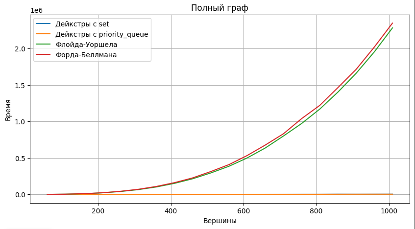
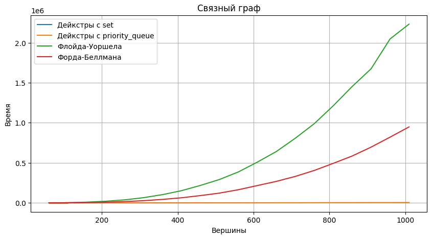
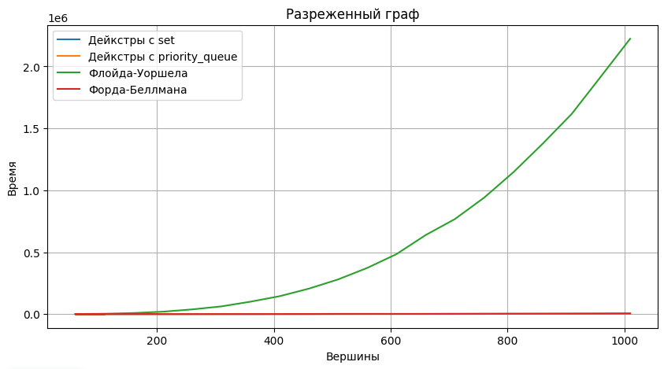

Взглянув на первые три графика мы можем сделать вывод, что в не зависимости от типа графа, алгоритм Флойда-Уоршела будет худшим.
Все дело в его скорости работы за куб. Алгоритм Форда-Беллмана же в свою очердь зависит от количества ребер. К такому выводу
мы можем прийти сравнив графики: на полном графе с большим количеством ребер он по скорости почти как Флойд-Уоршел,
на связном, где ребер меньше он уже заметно быстрее него, а на разреженном он по скорости уже не отличается от вариаций
Дейкстры (в сравнении с Флойдом-Уоршелом). Улучшенные вариации Дейкстры заметно универсальнее в данном плане.

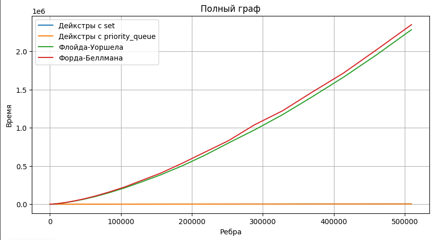
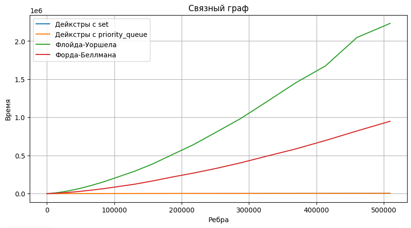
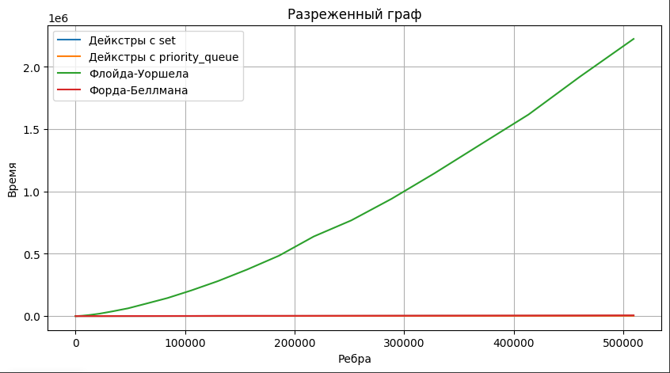

Следующие три графика в принципе подтверждают мою гипотезу о сильной зависимости время работы Форда-Беллмана от
количества ребер. В остальном выводы все те же.

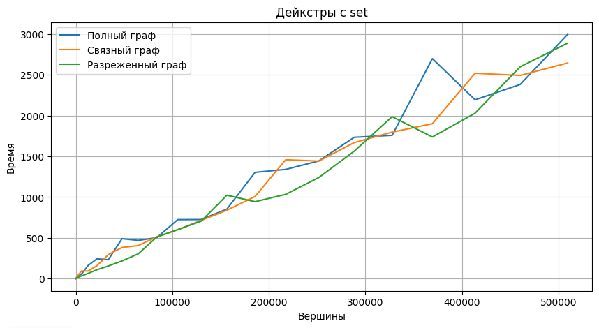
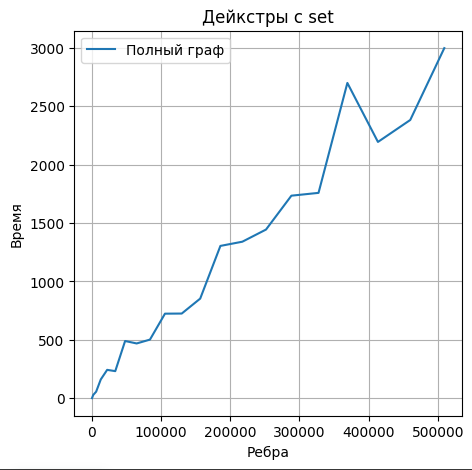
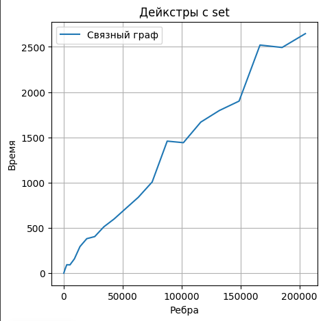
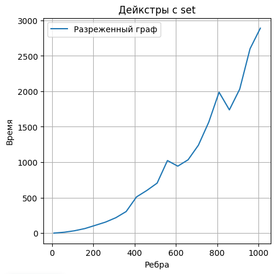

Следующие 4 графика показывают, что вариация алгоритма Дейкстры на set по времени почти не зависит от количества ребер
или вершин. В среднем одну будет примерно одним и тем же.

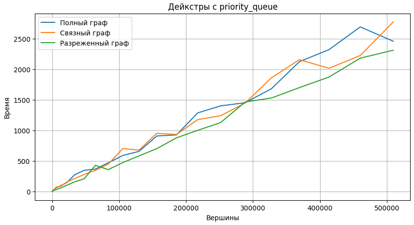
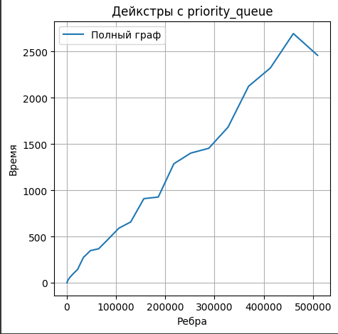
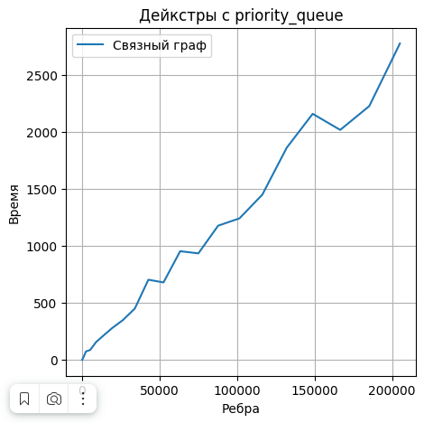
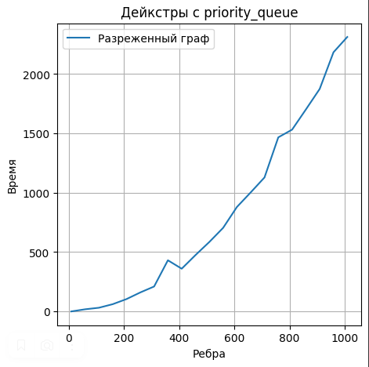

Следующие 4 графика показывают, что вариация алгоритма Дейкстры на priority_queue в принципе по ассимптотике схожа с
реализацией на set.

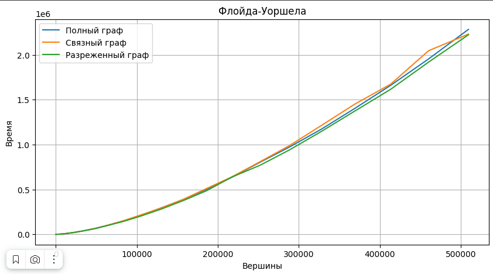
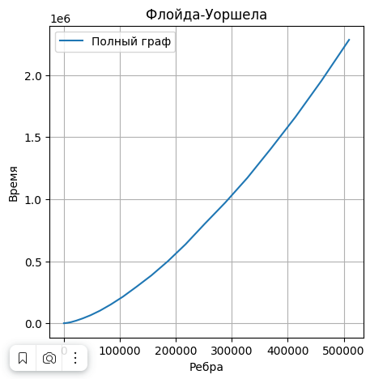
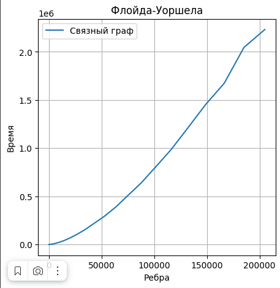
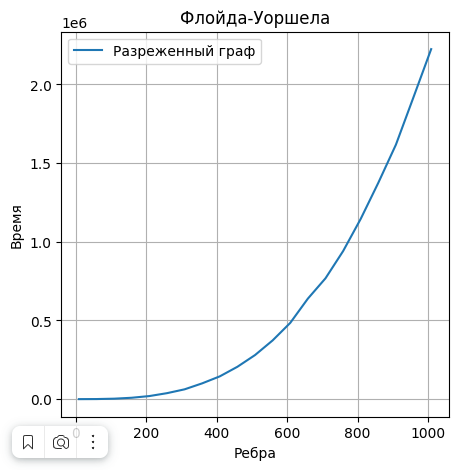

Эти 4 графика показывают, что ассиптотика Флойда-Уоршела не зависит от количества ребер, но от количества вершин.

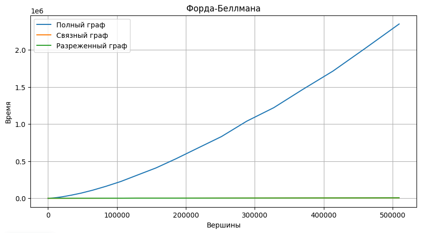
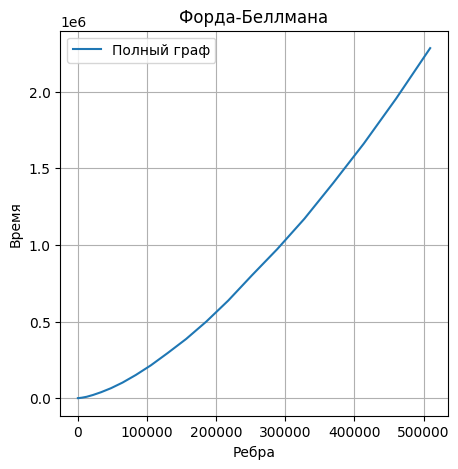
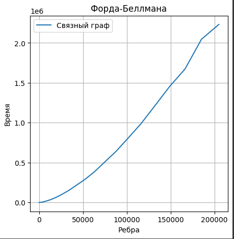
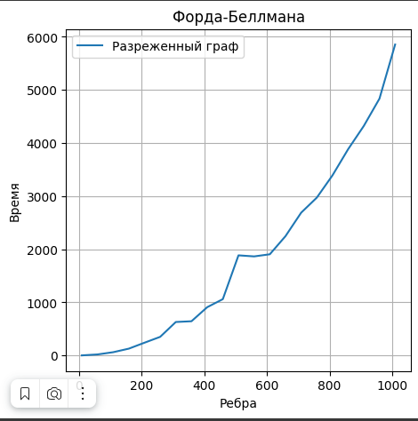

Эти 4 графика подтверждают мою гипотезу о сильной зависимости от количества ребер у Форда-Беллмана

